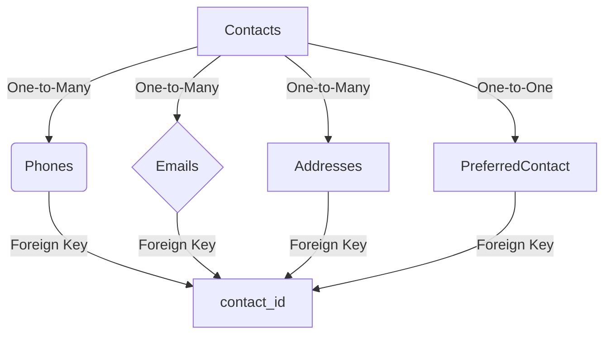

# Design Document

By Opeoluwa Adeyeri

Video overview: https://youtu.be/fdu82yvMp5k
---

## Scope

### Purpose
The purpose of this database is to provide a comprehensive system for managing contacts, including their phone numbers, email addresses, physical addresses, and preferred communication methods.

### In Scope
The database includes:
- Individuals' names and basic contact details.
- Multiple phone numbers (categorized as home, work, mobile, etc.).
- Multiple email addresses.
- Multiple physical addresses.
- A way to specify each contact's preferred communication method.

### Out of Scope
- Complex scheduling or calendar integration.
- Tracking communication history or message contents.
- Social media or additional metadata beyond basic contact information.

---

## Functional Requirements

### User Capabilities
- Add, update, and delete contacts.
- Store multiple phone numbers, emails, and addresses for each contact.
- Specify a preferred contact method (e.g., phone, email).
- Retrieve and search for contacts based on name, phone number, email, or address.

### Beyond Scope
- Advanced analytics, such as most-used contact methods.
- Bulk import/export or synchronization with third-party apps.
- Geographic proximity searches or mapping functionality.

---

## Representation

### Entities

1. **Contacts**
   - Attributes:
     - `contact_id` (Primary Key, INT, AUTO_INCREMENT)
     - `first_name` (VARCHAR(50))
     - `last_name` (VARCHAR(50))
   - Purpose: Represents individuals in the system.

2. **Phones**
   - Attributes:
     - `phone_id` (Primary Key, INT, AUTO_INCREMENT)
     - `contact_id` (Foreign Key, INT)
     - `phone_number` (VARCHAR(15))
     - `phone_type` (ENUM: 'Home', 'Work', 'Mobile', etc.)
   - Purpose: Stores multiple phone numbers per contact.

3. **Emails**
   - Attributes:
     - `email_id` (Primary Key, INT, AUTO_INCREMENT)
     - `contact_id` (Foreign Key, INT)
     - `email_address` (VARCHAR(100))
   - Purpose: Stores multiple email addresses per contact.

4. **Addresses**
   - Attributes:
     - `address_id` (Primary Key, INT, AUTO_INCREMENT)
     - `contact_id` (Foreign Key, INT)
     - `street` (VARCHAR(100))
     - `city` (VARCHAR(50))
     - `state` (VARCHAR(50))
     - `postal_code` (VARCHAR(15))
   - Purpose: Stores multiple physical addresses per contact.

5. **PreferredContact**
   - Attributes:
     - `preferred_id` (Primary Key, INT, AUTO_INCREMENT)
     - `contact_id` (Foreign Key, INT)
     - `method` (ENUM: 'Phone', 'Email', 'Address')
   - Purpose: Tracks the preferred method of communication.

---

### Relationships

- **One-to-Many**:
  - A contact can have multiple phone numbers, email addresses, and physical addresses.
- **One-to-One**:
  - Each contact can have only one preferred contact method.
- **Entity Relationship Diagram**:

### Optimizations

* Indexes:
    Added on contact_id in dependent tables (Phones, Emails, Addresses, and PreferredContact) to improve JOIN query performance.
    Added on commonly searched fields like email_address and phone_number.

* Normalization:
    The database is normalized to third normal form (3NF) to eliminate redundancy and ensure data integrity.

### Limitations

* Scalability:
    The database is designed for a moderate number of contacts; performance may degrade with millions of entries without additional optimizations.
* Custom Attributes:
    The system does not allow for custom fields or tags for contacts.
* Complex Querying:
    The design supports basic queries but lacks advanced full-text search or fuzzy matching for typos.